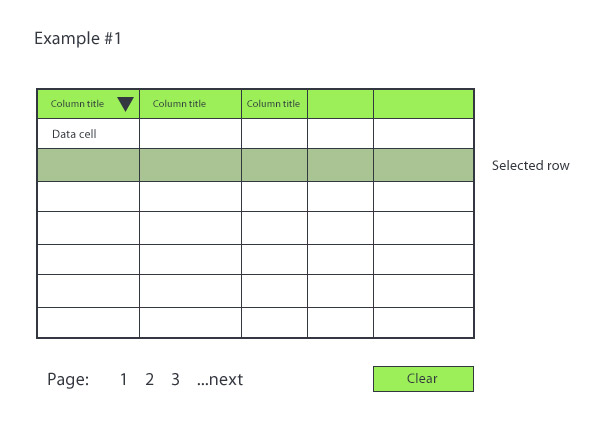

# Project example requirements.

Data will be fetched from [https://swapi.co/api/](https://swapi.co/api/) API endpoints.

## Design

## Technical requirements

- [ ] Data should be displayed in table style.

- [ ] As a user, I should be able to sort column by ascending, descending and without. Sort should be done by clicking on column header. Only one column should be sorted at the same time.

- [ ] As a user, I should be able to select/deselect multiple number of rows. Selection should be marked with row background color.

- [ ] As a user, I should be able to navigate through data by selecting page number or next and previous options.

- [ ] As a user, I should be able to clear any sort and any selection.

## Non-technical requirements

- [ ] As a user, I should be able to use example on wide range of devices with different screen size. Responsive layout could  be different on different screen size.